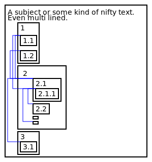

## SDG - Sophies Structure Diagram Generator

This is a command line application/script, that generates a structural diagram as CSV from configuration like XML.
An LOD argument can be used to get a simplified version of the diagram.

```diff
- THIS IS A PROTOTYPE and does not yet include all the designated features!
```

## ToDo for 1.0

- introduce command line interface/arguments
- write LOD transformer function
- allow horizontal alignment of children boxes
- optimize link drawing algorithms
- add link start/end icons
- prettify resulting diagram in general
- restructure and separate code into header and implementation files
- write build instructions
- provide prebuild binaries

## Example

```xml
<?xml version="1.0" encoding="UTF-8"?>
<box text="A subject or some kind of nifty text.\nEven multi lined.">
    <box text="1">
        <box id="1.1" text="1.1" />
        <box id="1.2" text="1.2" />
    </box>
    <box text="2">
        <box text="2.1">
            <link target="1.1" />
            <link target="1.2" />

            <box text="2.1.1">
                <link target="1.1" />
                <link target="2.2" />
            </box>
        </box>
        <box id="2.2" text="2.2" />
        <box text="" />
        <box />
    </box>
</box>
```

generates:



## Build instructions

todo

## Contribution

As i want to finish 1.0 on my own as an exercise, i won't apply pull request until that goal is reached, sorry.

## License

This application is made available under the GNU GENERAL PUBLIC LICENSE.
Please see the [LICENSE file](LICENSE) for further details.
