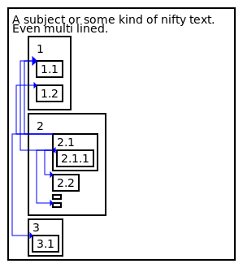
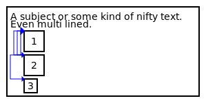

## SDG - Sophie's Structure Diagram Generator

A command line application/script, that generates a structural diagram as SVG from configuration like XML.
An LOD argument can be used to get a simplified version of the diagram.

```diff
- THIS IS A PROTOTYPE and does not yet include all the designated features!
```

## ToDo for 1.0

- bundle links in LOD reduction
- separate links vertically / at exit of box
- allow horizontal alignment of children boxes
- prettify resulting diagram in general
- write build instructions
- provide prebuild binaries
- cleanup prototype code

## Example

```xml
<?xml version="1.0" encoding="UTF-8"?>
<box text="A subject or some kind of nifty text.\nEven multi lined." rootMargin="10">
    <box text="1" childrenPadding="10" padding="10">
        <box id="1.1" text="1.1" />
        <box id="1.2" text="1.2" />
    </box>
    <box text="2" padding="10" linkPadding="10">
        <box text="2.1">
            <link target="1.1" />
            <link target="1.2" />
            <link target="3.1" />

            <box text="2.1.1">
                <link target="1.1" startCap="arrowOut" endCap="arrowIn:5" />
                <link target="2.2" />
                <link target="2.4" />
            </box>
        </box>
        <box id="2.2" text="2.2" />
        <box text="" />
        <box id="2.4" />
    </box>
    <box text="3">
        <box id="3.1" text="3.1" />
    </box>
</box>
```

generates:



and with an LOD of 2:



## Build instructions

```diff
- TODO/WIP
```

### Linux

1. apt install build-essential libcairo2-dev libxml2-dev
2. ...

## Contribution

As i want to finish 1.0 on my own as an exercise, i won't apply pull request until that goal is reached, sorry.

## Copyright & License

Copyright (c) Sophie Kühn

This application is made available under the GNU General Public License v3.0.  
Please see the [LICENSE](LICENSE) file for further details.
